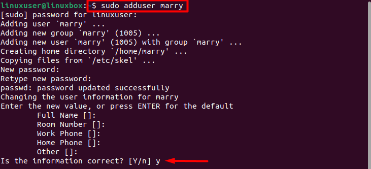
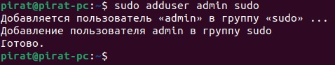

# Создание пользователя 
В качестве username - свое фамилия_имя в нижнем регистре
например ivanov_ivan
```
sudo adduser username
```
После этой ввода команды вас попросят ввести пароль.

Важно, что при вводе пароля символы в консоли не отображаются, но вводятся
Пароль делаем 123456789

После ввода попросит повторить пароль - повторяем.

Если все успешно попросит нажать Y - нажимаем. Пользователь создан



Теперь выдаем пользователю права супер пользователя, командой
```
sudo adduser username sudo 
```
Результат



